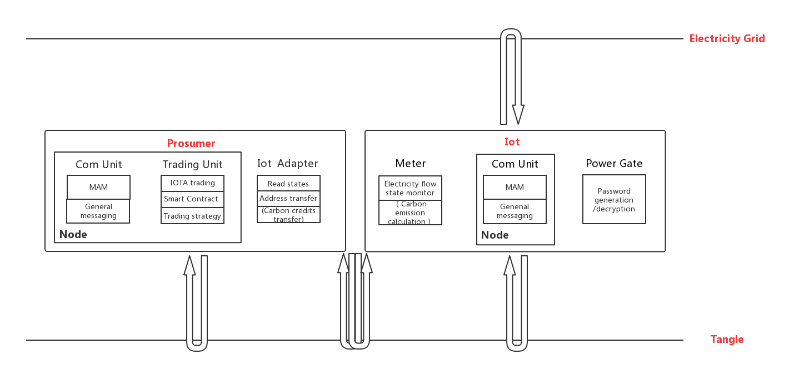

该项目为基于Python开发测试的IOTA交易平台， 
根据一些初步构想，该项目可能由以下模块组成： 
（注意：该结构可能并不合理，模块之间相互层级、独立关系仍待商榷） 
Iota_TradePlatform 
	* Basic
		* Activation  #用于Iot设备激活【确认供需是真实存在的】
		* Cipher  # 用于加密解密信息【Tangle上信息加密，但密码安全传输是个问题】
		* Node  # 用于建立基本节点【连接Tangle，最好支持协程并发】
		* Signature #用于生成密钥对【确认是设备的所有者发布的信息】
		* Structure  # 用于存放一系列数据结构【统一数据结构】
		* Transaction  # 用于构建可在Tangle上传输的数据结构【若不考虑加密解密是否有独立存在必要】
		* Public_Com  # 用于公开通信【如初始Tangle地址】
	* Consumer
		* Consumer  # 消费者客户端【继承Node，集成Public_Com，连接Iot等】
		* Price_Strategy  # 出价策略方法【单一价格或价格区间等】
		* Quantity_Strategy  # 购买量方法【单一量或量区间等】
	* Grid
		* Grid  # 能源网后端【继承Node，集成Public_Com、 Activation，数据库等】
		* Match  # 供需双方报价匹配策略
	* Iot
		* Energy_Transfer  # 模拟能源耗散与传送【依然用IOTA模拟？】
		* HashToAddress  # Iot设备hash值生成实时变化的物理地址【提高匿名性】
		* Iot  # Iot设备客户端【设备激活，接收私钥，发布存量及变化速率】
		* Signal_Generation  # 模拟能源生产【如果用IOTA，则需手动充值】
	* Producer
		* Price_Strategy  # 消费者客户端【继承Node，集成Public_Com，连接Iot等】
		* Producer  # 出价策略方法【单一价格或价格区间等】
		* Quantity_Strategy  # 出售量方法【单一量或量区间等】

